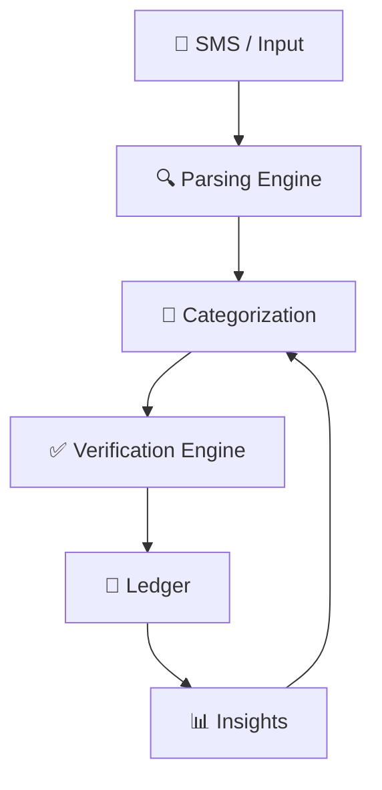

# 📒 KhaataKitab

### ⚡ Agentic AI Ledger for Real-World Finance

<p align="center">
  
  
  
</p>

<p align="center">
  <b>Observe • Understand • Verify • Assist</b><br/>
  Turning raw transaction signals into intelligent financial records
</p>

---

## 🚀 Live App

🔗 https://khaata-kitab.lovable.app

---

## 🧠 What Makes KhaataKitab Different?

Most finance apps expect users to **input everything manually**.

KhaataKitab flips that:

> It behaves like an **agent** that watches, processes, and assists —
> instead of waiting for user input.

---

## 🎯 Problem → Insight → Solution

| 🚨 Problem         | 💡 Insight            | ⚡ Solution           |
| ------------------ | --------------------- | -------------------- |
| Scattered payments | SMS already has truth | Read & structure SMS |
| Manual errors      | Users forget entries  | Auto + verify system |
| No trust in data   | Raw logs ≠ reliable   | Verification engine  |
| No clarity         | Data ≠ insight        | Smart analytics      |

---

## ⚙️ Core System Capabilities

### 📲 Passive Transaction Capture

* Reads financial SMS (Android)
* Converts unstructured text → structured data

---

### 🧠 Intelligent Categorization

* Semantic + keyword-based mapping
* Learns from corrections (feedback loop)

---

### ✅ Verification Engine *(Trust Layer)*

* Matches manual entries with SMS data
* Compares:

  * amount
  * time
  * merchant
  * payment method

✔ Outputs:

* **Verified**
* **Needs Review**

---

### 📊 Insight Layer

* Monthly summaries
* Category distribution
* Financial awareness at a glance

---

## ✨ UI/UX Intelligence (Latest Enhancements)

> Not just functional — **responsive, adaptive, and intuitive**

### 🔐 Authentication Flow

* Lightweight login system (local storage-based)
* Protected routes + session persistence
* Logout integrated into profile settings

---

### 🏷️ Smart Transaction Feedback

* “Needs Review” badge:

  * No overlap issues
  * Smooth fade-out on verification
* Real-time UI state updates

---

### 🎯 Editable Financial Goals

* Monthly income goal with modal editing
* Immediate visual feedback

---

### 📱 Fully Responsive Experience

* Adaptive grid:

  * 1 column → mobile
  * 2 → tablet
  * 3 → desktop
* Smooth animations:

  * Fade-in
  * Slide-up
  * Scale transitions

---

### 🎨 Micro-Interactions & Polish

* Hover elevation effects
* Consistent spacing & alignment
* 200–300ms smooth transitions
* Dark mode optimized

---

## 🎬 System Flow



---

## 🤖 Why This is Agentic AI

<details>
<summary>Click to explore</summary>

* 🔍 **Perception** → Reads SMS data
* 🧠 **Reasoning** → Categorizes transactions
* ⚖️ **Decision-making** → Verifies vs flags
* 🔁 **Learning loop** → Improves via user feedback

👉 This is a **behavior-driven system**, not static CRUD

</details>

---

## 🛠️ Tech Stack

<p align="center">
  
</p>

---

## ⚡ Engineering Highlights

* Designed **verification logic pipeline**
* Built **semantic categorization engine**
* Implemented **real-time UI sync**
* Integrated **mobile SMS-based data ingestion**
* Structured system for **future ML scaling**

---

## 🚀 Run Locally

```bash id="run123"
git clone <YOUR_GIT_URL>
cd <PROJECT_NAME>
npm install
npm run dev
```

---

## 🔮 Future Roadmap

* 📈 ML-powered categorization
* 🔐 Secure authentication (JWT / biometrics)
* 💳 Credit scoring indicators
* 🌍 Multi-language support
* ☁️ Cloud sync + backups

---

## 💬 Philosophy

> The future of apps is not interaction.
> It’s **automation with intelligence**.

---

## 📄 License

MIT License
